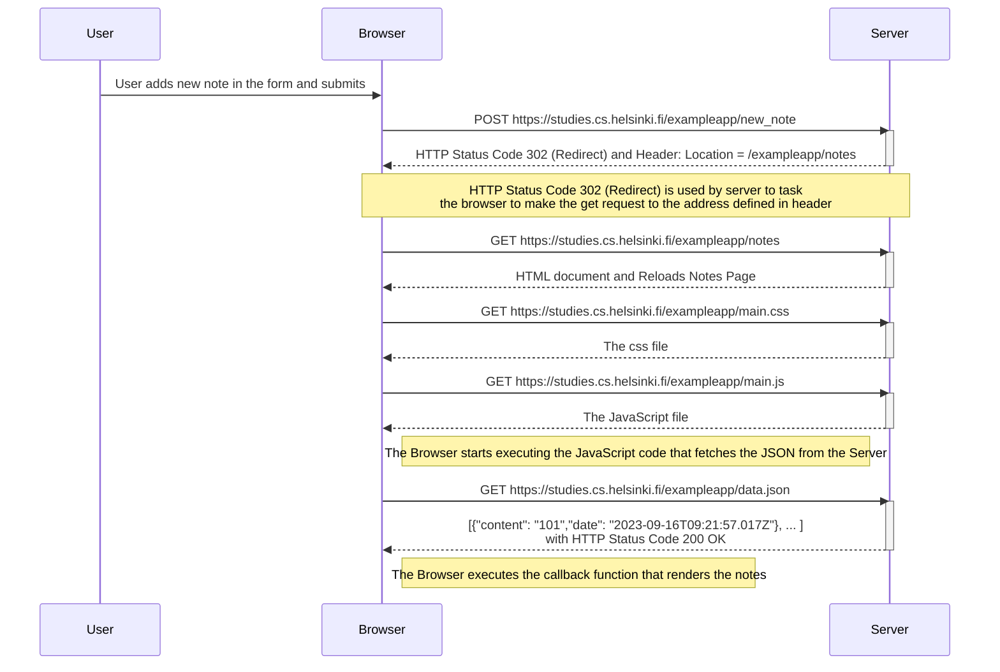

```mermaid
sequenceDiagram
participant User as User
participant Browser as Browser
participant Server as Server

User->>Browser: User adds new note in the form and submits

Browser->>Server: POST https://studies.cs.helsinki.fi/exampleapp/new_note
activate Server
Server-->>Browser: HTTP Status Code 302 (Redirect) and Header: Location = /exampleapp/notes
deactivate Server

Note over Browser,Server: HTTP Status Code 302 (Redirect) is used by server to task <br/> the browser to make the get request to the address defined in header


Browser->>Server: GET https://studies.cs.helsinki.fi/exampleapp/notes
activate Server
Server-->>Browser: HTML document and Reloads Notes Page
deactivate Server

Browser->>Server: GET https://studies.cs.helsinki.fi/exampleapp/main.css
activate Server
Server-->>Browser: The css file
deactivate Server

Browser->>Server: GET https://studies.cs.helsinki.fi/exampleapp/main.js
activate Server
Server-->>Browser: The JavaScript file
deactivate Server

Note right of Browser: The Browser starts executing the JavaScript code that fetches the JSON from the Server

Browser->>Server: GET https://studies.cs.helsinki.fi/exampleapp/data.json
activate Server
Server-->>Browser: [{"content": "101","date": "2023-09-16T09:21:57.017Z"}, ... ] <br/> with HTTP Status Code 200 OK
deactivate Server

Note right of Browser: The Browser executes the callback function that renders the notes
```
