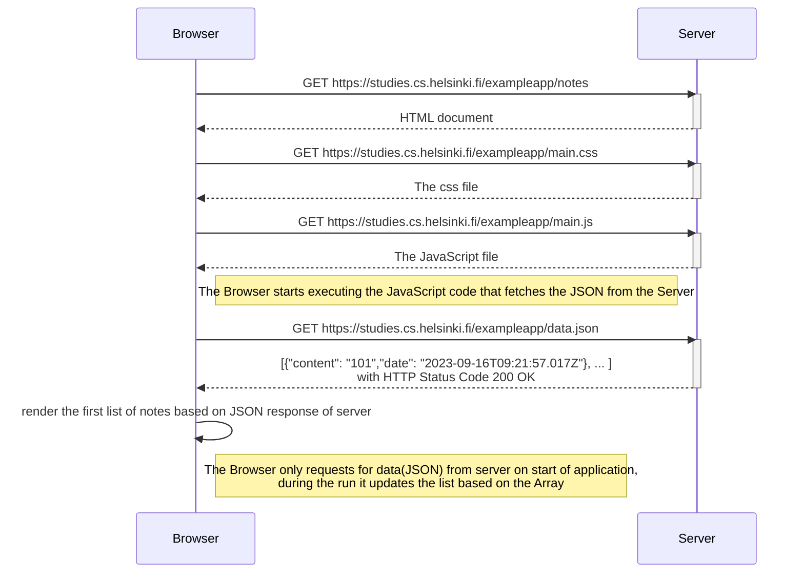

```mermaid
sequenceDiagram
participant Browser as Browser
participant Server as Server

Browser->>Server: GET https://studies.cs.helsinki.fi/exampleapp/notes
activate Server
Server-->>Browser: HTML document
deactivate Server

Browser->>Server: GET https://studies.cs.helsinki.fi/exampleapp/main.css
activate Server
Server-->>Browser: The css file
deactivate Server

Browser->>Server: GET https://studies.cs.helsinki.fi/exampleapp/main.js
activate Server
Server-->>Browser: The JavaScript file
deactivate Server

Note right of Browser: The Browser starts executing the JavaScript code that fetches the JSON from the Server

Browser->>Server: GET https://studies.cs.helsinki.fi/exampleapp/data.json
activate Server
Server-->>Browser: [{"content": "101","date": "2023-09-16T09:21:57.017Z"}, ... ] <br/> with HTTP Status Code 200 OK
deactivate Server
Browser->>Browser: render the first list of notes based on JSON response of server
Note right of Browser: The Browser only requests for data(JSON) from server on start of application, <br/>during the run it updates the list based on the Array
```
