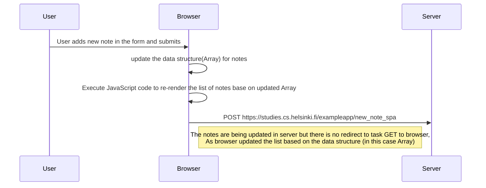

```mermaid
sequenceDiagram
participant User as User
participant Browser as Browser
participant Server as Server

User->>Browser: User adds new note in the form and submits
Browser->>Browser: update the data structure(Array) for notes
Browser->>Browser: Execute JavaScript code to re-render the list of notes base on updated Array

Browser->>Server: POST https://studies.cs.helsinki.fi/exampleapp/new_note_spa
Note left of Server: The notes are being updated in server but there is no redirect to task GET to browser,<br/> As browser updated the list based on the data structure (in this case Array)

```
