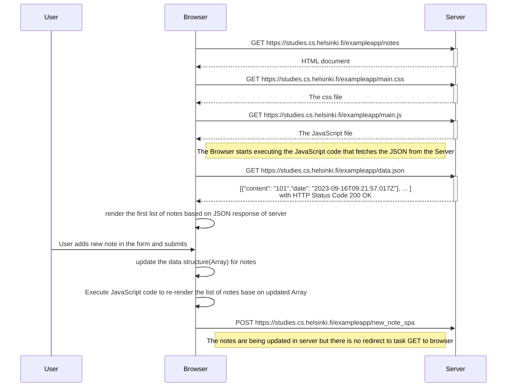

```mermaid
sequenceDiagram
participant User as User
participant Browser as Browser
participant Server as Server

Browser->>Server: GET https://studies.cs.helsinki.fi/exampleapp/notes
activate Server
Server-->>Browser: HTML document
deactivate Server

Browser->>Server: GET https://studies.cs.helsinki.fi/exampleapp/main.css
activate Server
Server-->>Browser: The css file
deactivate Server

Browser->>Server: GET https://studies.cs.helsinki.fi/exampleapp/main.js
activate Server
Server-->>Browser: The JavaScript file
deactivate Server

Note right of Browser: The Browser starts executing the JavaScript code that fetches the JSON from the Server

Browser->>Server: GET https://studies.cs.helsinki.fi/exampleapp/data.json
activate Server
Server-->>Browser: [{"content": "101","date": "2023-09-16T09:21:57.017Z"}, ... ] <br/> with HTTP Status Code 200 OK
deactivate Server
Browser->>Browser: render the first list of notes based on JSON response of server

User->>Browser: User adds new note in the form and submits
Browser->>Browser: update the data structure(Array) for notes
Browser->>Browser: Execute JavaScript code to re-render the list of notes base on updated Array

Browser->>Server: POST https://studies.cs.helsinki.fi/exampleapp/new_note_spa
Note left of Server: The notes are being updated in server but there is no redirect to task GET to browser

```
